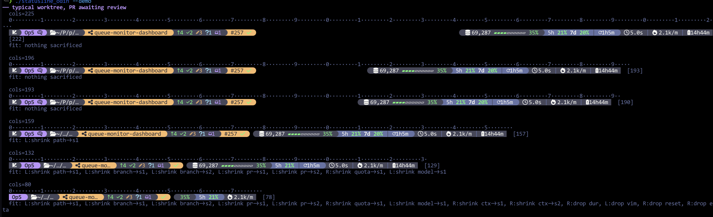
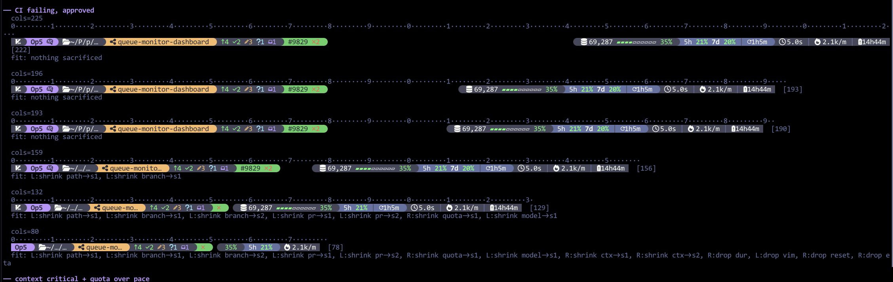
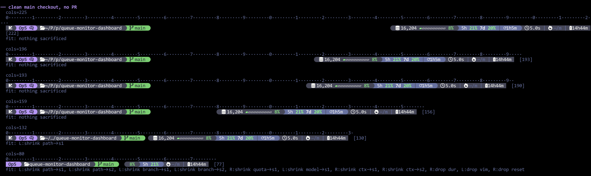
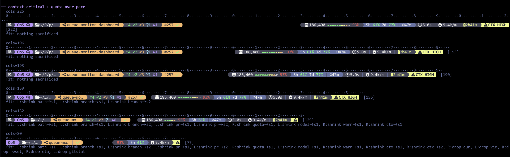
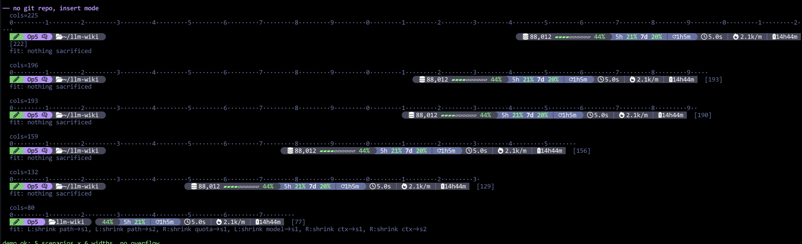

# claude-statusline

A fast, width-adaptive statusline for [Claude Code](https://claude.com/claude-code), written in Odin.

One line, right-sized to your terminal: model, path, git branch + dirty counts, PR/CI state, context bar, quota levels, burn rate, and a quota-cap ETA. Everything is cached in `/dev/shm` and refreshed in detached background processes, so a render is ~200µs on a cache hit and never blocks your prompt.

> This repo also contains a legacy C implementation (`statusline.c`, `Makefile.c-legacy`). It is no longer the one being developed — everything below is the Odin workflow.

## Requirements

Not everything below applies to both install options. **Option A needs no toolchain — no Odin, no `make`, no compiler** — only the rows marked "both", plus its own runtime floor.

| Thing | Needed for | Why | Notes |
|---|---|---|---|
| Linux with `/dev/shm` | both | cache files | macOS/BSD are not supported |
| A Nerd Font + truecolor terminal | both | icons and Dracula colors | e.g. Ghostty, kitty, WezTerm |
| `git` | both | branch + status | invoked directly, no shell; outside a repo those segments are just absent |
| `gh` | both, optional | PR number, review state, CI status | segment is skipped if missing |
| `curl` | both, optional | Opus weekly quota window | other quota figures come from Claude Code's own JSON |
| glibc 2.35+, AVX-512 CPU | **Option A only** | running the prebuilt binary | it is built `-microarch:native` on the ITADM box; an older glibc or a CPU without AVX-512 needs Option B |
| [Odin compiler](https://odin-lang.org/docs/install/) | **Option B only** | builds the binary | `odin` must be on `PATH`; there is no system-wide install on the ITADM box, so you install it yourself |
| `make` | **Option B only** | drives the build and install | plus a working `~/.claude` directory to install into |

## Install

Everyone runs their own copy — install it per developer, not once for the box, so you're free to modify your own. Pick whichever option fits; both end up at `~/.claude/statusline`, so the settings block below is identical either way and you can switch later.

### Option A — prebuilt binary (no toolchain, nothing to build)

```sh
curl -L -o ~/.claude/statusline https://github.com/jonesnc/claude-statusline/releases/latest/download/statusline-linux-x86_64
chmod +x ~/.claude/statusline
```

Built with `-microarch:native` on the ITADM server's Cascade Lake Xeon, so **it contains AVX-512 and will `SIGILL` on a CPU without it** — use Option B anywhere else. Needs glibc 2.35+. Does not auto-update: re-run the `curl` to pick up changes.

### Option B — build from source (customizable, auto-updating)

```sh
git clone git@github.com:jonesnc/claude-statusline.git ~/Projects/claude-statusline
cd ~/Projects/claude-statusline
make install-odin
```

That builds `statusline_odin` and copies it to `~/.claude/statusline`. Requires an Odin toolchain. In exchange you get [auto-update](#auto-update) and a tree you can edit.

### Point Claude Code at it

In `~/.claude/settings.json`:

```json
{
  "statusLine": {
    "type": "command",
    "command": "~/.claude/statusline"
  }
}
```

Start a new Claude Code session (or `/config`-reload) and the line appears.

### Build without installing

```sh
make odin     # produces ./statusline_odin
make clean
```

Build flags are `-o:speed -no-bounds-check -disable-assert -microarch:native`. `-microarch:native` targets the CPU you build on — that's why the released binary is AVX-512 and machine-specific. Drop it if you need a portable build.

If `odin build` complains it cannot find the `base` collection, the Makefile already resolves `ODIN_ROOT` via `odin root` and falls back to `/usr/lib/odin`, `/usr/share/odin`, `~/Odin`, `~/odin`. Set `ODIN_ROOT` yourself if your install lives somewhere else:

```sh
make install-odin ODIN_ROOT=/path/to/odin
```

## Auto-update

**Option B only.** `make install-odin` writes the repo path to `~/.claude/statusline-src`; that pointer file is the whole trigger. Once every 24h the statusline detaches a background process that runs `git pull --ff-only` followed by `make install-odin` in that directory. Option A leaves no pointer file, so a downloaded binary never updates itself — re-run the `curl` instead.

Since Option B clones this repo directly, that means **you track `main` automatically**: my pushes land in your statusline within a day, without you doing anything.

What happens once you start customizing:

- **Committed local changes.** `git pull --ff-only` refuses to fast-forward a diverged branch and fails — but the failure is ignored and `make install-odin` runs anyway, so your build is reinstalled from your tree. You keep your version and simply stop receiving mine. Merge or rebase by hand when you want to catch up.
- **Uncommitted edits.** Same outcome if the pull can't apply cleanly; otherwise it fast-forwards under you and rebuilds with your working-tree changes included.
- **Want both.** Fork on GitHub, point `origin` at your fork, and merge upstream on your own schedule — auto-update then follows your fork.

To turn it off entirely, delete the pointer file. The statusline keeps working; it just stops rebuilding itself:

```sh
rm ~/.claude/statusline-src
```

## Verify it works

Render against synthetic JSON:

```sh
echo '{"current_dir":"'$PWD'","display_name":"Opus 5","total_duration_ms":120000}' | ./statusline_odin
```

Check the layout logic at six terminal widths across five scenarios:

```sh
./statusline_odin --demo
```

Compare C vs Odin output side by side:

```sh
make bench
```

## What it looks like

Narrow terminals never wrap. Segments shrink through predefined stages and the lowest-priority ones drop out entirely. `./statusline_odin --demo` renders all five scenarios at six widths with a column ruler, the measured width in brackets, and a `fit:` log naming every shrink and drop it applied — the screenshots below are that output.

**Dirty worktree, PR awaiting review.** Orange branch = uncommitted work; orange PR background = review required. By 132 cols the path, branch and PR have all shrunk; by 80 the duration, reset countdown and ETA are gone.



**CI failing, approved.** Review state and CI state are independent and shown independently: green background says approved, the red `✗2` says two checks failed. At 132 cols the PR number goes and the bare red ✗ stays — the failure survives longer than the identity, because it's the part that needs acting on.



**Clean `main`, no PR.** Green branch, no counters, no PR segment — nothing to report, so nothing takes up space, and the full path survives all the way down to 132 cols.



**Context critical, quota over pace.** The bar goes red at 93% and the `CTX HIGH` banner appears; 5h sits at 61% but is colored by *projection*, and the battery ETA says the cap arrives in 2h41m. At 132 cols the banner keeps its slot as a bare icon rather than dropping — it's marked non-droppable.



**No git repo, vim insert mode.** Outside a repo the branch, counters and PR segments simply don't exist; the green pencil at far left is vim insert mode.



## What's on the line

Segments are priority-ranked. When the terminal is narrow they shrink through
predefined stages (full → abbreviated → icon-only) and low-priority ones drop
entirely, so the line never wraps.

Identity sits flush left, budget flush right, whitespace between them. Each icon below is shown as it actually renders, on the background color it actually sits on.

### Left — what you're working on

| Icon | Segment | What it tells you |
|:---:|---|---|
|   | **vim mode** | Shown only when vim mode is on. Green pencil = insert, dark vim logo = normal. |
| — | **model** | Always abbreviated (`Op5`). Never shows the full display name. |
|  | **thinking** | Trails the model when extended thinking is on. First thing dropped when space runs short. |
|  | **path** | Abbreviated cwd. Collapses to `…` when the directory name duplicates the branch — the branch segment already says it. |
|   | **branch** | Green when clean, orange when dirty. |
|  | **branch (worktree)** | Replaces the branch icon in a linked worktree. |
| `↑` `↓` | **ahead / behind** | Commits not pushed (green) and not pulled (red). |
|  | **staged** | Green. |
|  | **modified** | Orange. |
|  | **untracked** | Cyan. |
|  | **stashes** | Purple. |
| `#257` | **PR** | The number is an OSC8 hyperlink to the PR, costing zero cells. Background carries *review* state: green approved, orange review-required, dark undecided. |
|  `✗` `●` `⊘` | **CI** | Passing / failing / pending / draft. Failing also shows a count of failed checks. |

### Right — what it's costing you

| Icon | Segment | What it tells you |
|:---:|---|---|
|  | **context tokens** | Current occupancy of the context window. |
| `▰` `▱` | **context bar** | 10 cells → 5 cells → bare percentage as space runs out. Colored by zone: green, yellow at 65%, orange at 80%, red at 90%. |
| — | **quota** | `5h` and `7d` levels. The number is the level; its *color* is the projection — where the window lands at your current pace. `op` appears for the Opus weekly cap once it passes 50%. |
|  | **reset** | Countdown to the next window reset. Always white: a reset is relief, not risk. |
|  | **duration** | Session wall-clock time. |
|  | **burn rate** | Tokens per minute. Shows `—/m` until it has two samples. |
|  | **quota ETA** | Time until the 5h window hits 100% at the current pace — the far-right field, and the one that answers "will I get cut off". Shows `—` when not yet computable. |
|  | **context warning** | `CTX HIGH` past 88%, `COMPACT NOW` past 94%. Non-droppable: it shrinks to the bare icon rather than disappearing. |

### Color scale

The same four colors mean the same thing everywhere: green fine, yellow worth knowing, orange act soon, red act now.

| Field | Yellow | Orange | Red |
|---|---|---|---|
| context bar / % | 65% | 80% | 90% |
| quota level (`5h`, `7d`) | — | 80% | 90% |
| quota projection (drives `5h` color) | 105% | 140% | 200% |
| quota ETA | under 3h | under 1h | under 15m |

## Environment variables

| Variable | Effect |
|---|---|
| `STATUSLINE_DEBUG` | set to anything to write timing logs to `/tmp/statusline-<uid>/<pid>.log` |
| `COLUMNS` | override the detected terminal width (otherwise `ioctl`, falling back to 120) |

## Cache files

All caches are self-invalidating and cleaned up periodically; deleting them is always safe.

```
/dev/shm/statusline-cache.<gppid>   per-session state (flicker prevention)
/dev/shm/statusline-usage-shared    account-wide quota cache
/dev/shm/statusline-cleanup.<uid>   cleanup-interval sentinel
/dev/shm/claude-git-<hash>          per-repo git status
/dev/shm/claude-pr-<hash>           per-worktree+branch PR/CI status
```

## Uninstall

```sh
rm ~/.claude/statusline ~/.claude/statusline-src ~/.claude/statusline-last-update
rm -f /dev/shm/statusline-* /dev/shm/claude-git-* /dev/shm/claude-pr-*
```

and remove the `statusLine` block from `~/.claude/settings.json`.
